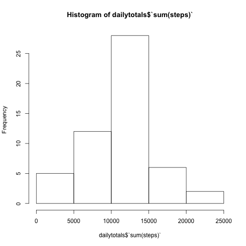
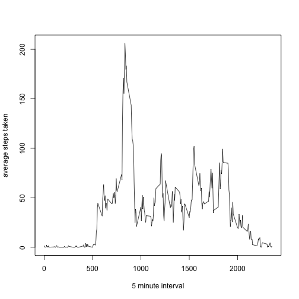

## Loading and preprocessing the data
The script will load raw activity data and remove incomolete cases from the dataset.
The script downloads the data directly from the web and unzips it for use in a temporary location


```r
## Reads 

tFile <- tempfile()
download.file("https://d396qusza40orc.cloudfront.net/repdata%2Fdata%2Factivity.zip", tFile)
fList <- unzip(tFile)
rawdataset <- read.csv(fList[1])
dataset <- rawdataset[complete.cases(rawdataset[1:3]),]

##read.csv(file.path(tDir,"activity.csv"))
```
## What is mean total number of steps taken per day?
Data for average steps per day.
The histogram shows the frequency with which particular numbers of steps occur on multiple days. The highest frequency is the modal number of steps.

```r
library(dplyr)
dailytotals <- summarise(group_by(dataset, date), sum(steps))
hist(dailytotals$`sum(steps)`)
```

 
The mean and median numbers of steps follow:

```r
mean(dailytotals$`sum(steps)`)
```

```
## [1] 10766.19
```

```r
median(dailytotals$`sum(steps)`)
```

```
## [1] 10765
```
## What is the average daily activity pattern?

```r
patterndata <- summarise(group_by(dataset, interval), mean(steps))
plot(patterndata$interval,patterndata$`mean(steps)`, type="l", xlab="5 minute interval", ylab="average steps taken")
```

 
## Imputing missing values
The total number of rows with missing values is:

```r
length(rawdataset[,1]) - length(dataset[,1]) 
```

```
## [1] 2304
```

To examine the impact of these unknown values imputation based on the number of average number of steps that typically occur during that daily interval can be made as follows...


```r
impute <- function(val, interval) {
  if (is.na(val)) {
    patterndata[patterndata$interval == 5,]$`mean(steps)`
  } else {
    val
  }
}
imputeddata <- rawdataset
for(i in 1:length(imputeddata[,1])) {
  imputeddata[i,1] <- impute(imputeddata[i,1],imputeddata[i,3])
}
imputeddata <- transmute(imputeddata, steps = impute(steps,interval))
```

```
## Warning in if (is.na(val)) {: the condition has length > 1 and only the
## first element will be used
```
Recomputing the histogram and averages with imputed values shows the following difference:

```r
## recalculate averages

dailytotals <- summarise(group_by(imputeddata, date), sum(steps))
```

```
## Error in eval(expr, envir, enclos): unknown column 'date'
```

```r
hist(dailytotals$`sum(steps)`)
```

 
The mean and median numbers of steps follow:

```r
mean(dailytotals$`sum(steps)`)
```

```
## [1] 10766.19
```

```r
median(dailytotals$`sum(steps)`)
```

```
## [1] 10765
```

## Are there differences in activity patterns between weekdays and weekends?
